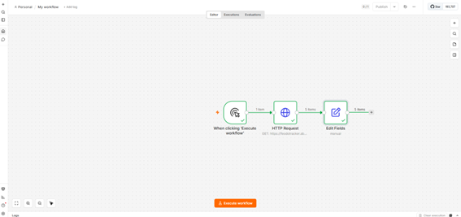
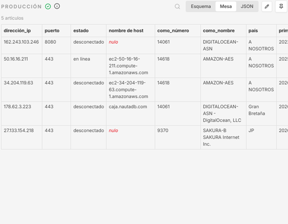
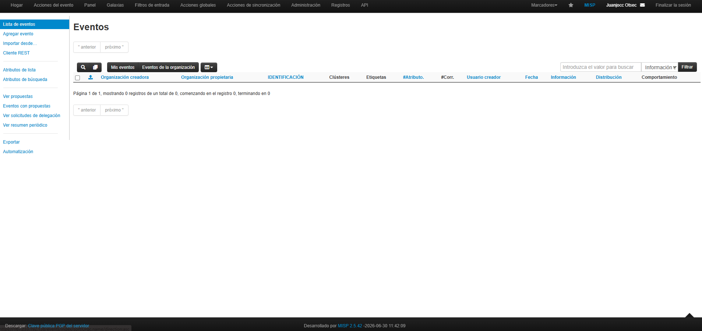
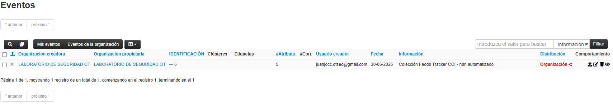
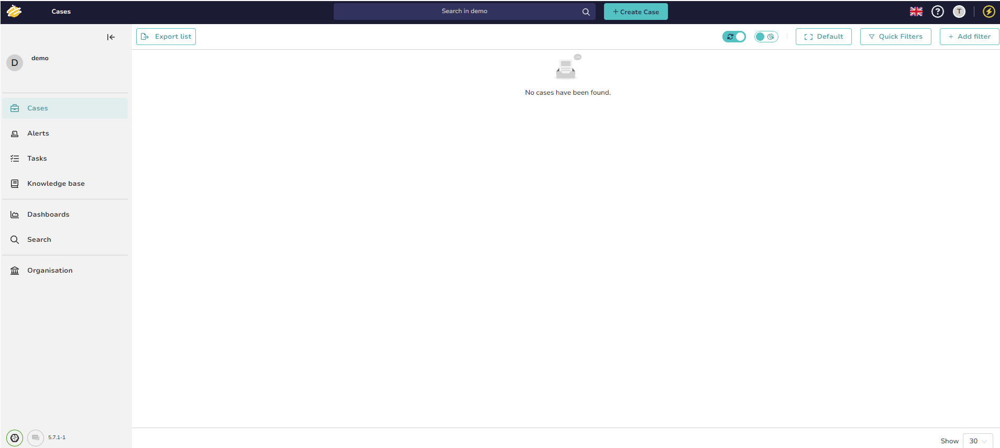

# OT/ICS Threat Intelligence Lab

A self-hosted, Docker Compose-based threat intelligence and incident response lab built to demonstrate practical OT/ICS security workflows: threat data collection, enrichment, correlation, and case management — automated end to end.

## Why this lab exists

Most OT/ICS security tooling in production environments (TXOne Stellar, Armis Centrix, etc.) operates on top of a broader threat intelligence and incident response stack. This repository is a hands-on reconstruction of that stack, built to:

- Demonstrate operational familiarity with the core open-source TI/IR toolchain used across SOC environments (MISP, OpenCTI, TheHive)
- Show automation capability connecting these tools via n8n instead of manual triage
- Provide a reproducible reference architecture relevant to critical infrastructure (energy, rail, healthcare) security operations

## Architecture


┌─────────────────┐

OSINT Feeds ─▶│   Python IOC     │

(public CTI)  │   Collectors     │

└────────┬─────────┘

▼

┌─────────────────┐

│      MISP        │  ◀── IOC sharing & tagging

└────────┬─────────┘

▼

┌─────────────────┐

│    OpenCTI       │  ◀── Knowledge graph, threat actors, TTPs

└────────┬─────────┘

▼

┌─────────────────┐

│      n8n         │  ◀── Automation / orchestration layer

└────────┬─────────┘

▼

┌─────────────────┐

│     TheHive      │  ◀── Case management & alert triage

└─────────────────┘


## Components

**MISP** — Malware Information Sharing Platform. Central repository for indicators of compromise (IOCs), tagged and structured for sharing and correlation.

**OpenCTI** — Threat intelligence platform that models threat actors, campaigns, and TTPs (MITRE ATT&CK / ATT&CK for ICS) as a knowledge graph, ingesting data from MISP.

**TheHive** — Case and alert management. Alerts generated from correlated intel are escalated here for analyst triage and investigation tracking.

**n8n** — Low-code automation layer connecting the above: polls OSINT feeds, pushes IOCs into MISP, triggers OpenCTI enrichment, and raises cases in TheHive when correlation thresholds are met.

**Python IOC Collectors** — Lightweight scripts pulling indicators from public OSINT feeds (abuse.ch, AlienVault OTX, etc.) and normalizing them for MISP ingestion.

## Stack

| Layer | Technology |
|---|---|
| Containerization | Docker Compose |
| Threat Intel Sharing | MISP |
| Threat Intel Graph | OpenCTI |
| Case Management | TheHive |
| Automation | n8n |
| Search/Logging | Elasticsearch + Kibana |
| IOC Collection | Python |

## Getting started

```bash
git clone https://github.com/ot-sec-lab-dev/ot-sec-lab-dev.git
cd ot-sec-lab-dev
cp .env.example .env   # set your own credentials/API keys
docker compose up -d
```

Default service ports (adjust in `.env` as needed):

| Service | Port |
|---|---|
| MISP | 443 |
| OpenCTI | 8080 |
| TheHive | 9000 |
| n8n | 5678 |
| Kibana | 5601 |

## Repository structure

ot-sec-lab-dev/

├── 01-n8n/

│   ├── docker-compose.yml

│   ├── .env.example

│   └── ioc-collector-feodo-tracker.json

├── 02-misp/

│   └── SETUP.md

├── 03-thehive/

│   └── SETUP.md

├── 04-opencti/

│   └── SETUP.md

└── README.md

## Current implementation

**Phase 1 — n8n IOC Collector**




**Phase 2 — MISP**






**Phase 3 — TheHive + Cortex**



## Roadmap

- [x] Phase 1: n8n — IOC collection workflow (Feodo Tracker / abuse.ch)
- [x] Phase 2: MISP — IOC sharing and tagging platform (deployed on Hetzner Cloud)
- [x] Phase 3: TheHive + Cortex — case management and alert triage (deployed on Hetzner Cloud)
- [ ] Phase 4: OpenCTI — threat intelligence knowledge graph
- [x] n8n → MISP integration: automated IOC ingestion via REST API (single event, grouped attributes, auto-correlation)
- [ ] End-to-end walkthrough: OSINT → IOC → MISP → OpenCTI → TheHive case
- [ ] ATT&CK for ICS mapping examples
- [ ] Kibana dashboards for IOC volume and source breakdown

## About

Built and maintained by an OT/ICS and IoMT security analyst with hands-on experience securing critical infrastructure environments (rail, healthcare) using commercial platforms (TXOne Stellar, Armis Centrix). This lab serves as an open, vendor-agnostic complement to that work.

## License

MIT

