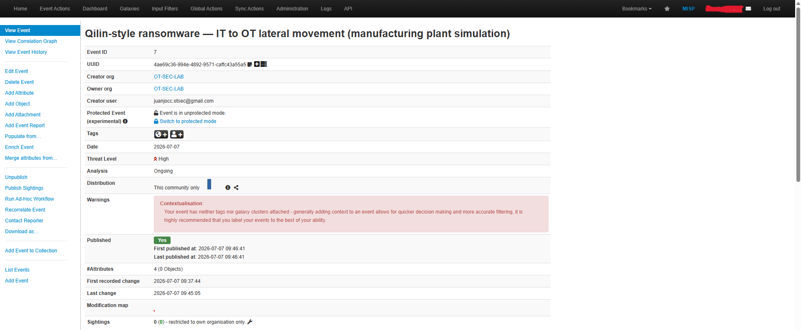
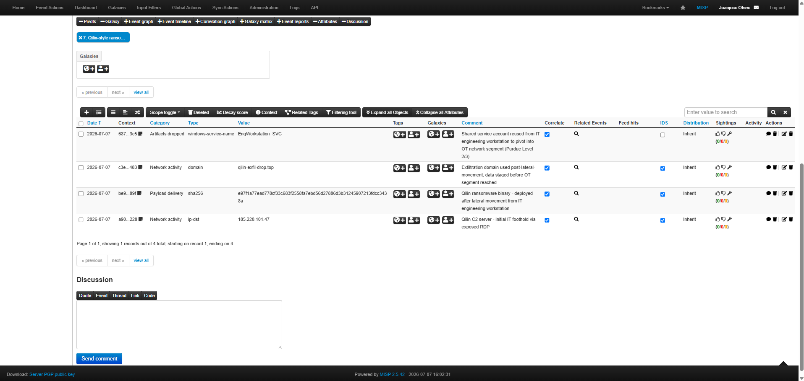

# Case Study 01 – Qilin Ransomware: IT to OT Lateral Movement

## Scenario

A manufacturing company suffers a ransomware intrusion initiated from the corporate IT network.

The attacker exploits an Internet-facing service, gains access to an engineering workstation, steals privileged credentials and moves laterally towards the Operational Technology (OT) environment.

The scenario reproduces one of the most common attack paths observed in industrial environments during 2025–2026, where ransomware groups compromise IT infrastructure before attempting to impact OT assets.

---

## Objectives

* Detect malicious infrastructure using MISP.
* Share Indicators of Compromise (IOCs).
* Automatically synchronize intelligence with OpenCTI.
* Generate CTI knowledge for incident response.
* Demonstrate an end-to-end Threat Intelligence workflow.

---

## Technologies

* MISP
* OpenCTI
* TheHive
* Cortex
* n8n
* MITRE ATT&CK for ICS

---

## Attack Flow

1. Attacker exploits an exposed Internet-facing service.
2. Initial access to an engineering workstation.
3. Credential theft.
4. Lateral movement from IT to OT.
5. Deployment of Qilin ransomware.
6. IOC publication in MISP.
7. Automatic synchronization with OpenCTI.
8. CTI enrichment and correlation.

---

## Indicators of Compromise (IOCs)

* Destination IP
* Malicious domain
* SHA256 hash
* Windows service name

---

## Evidence

### MISP Event Overview

### Indicators of Compromise stored in MISP

---

## Lessons Learned

* MISP centralizes IOC management and sharing.
* OpenCTI automatically transforms IOCs into structured cyber threat intelligence.
* Threat intelligence workflows significantly reduce analyst response time.
* The architecture demonstrates practical IT/OT threat intelligence integration suitable for industrial environments.
